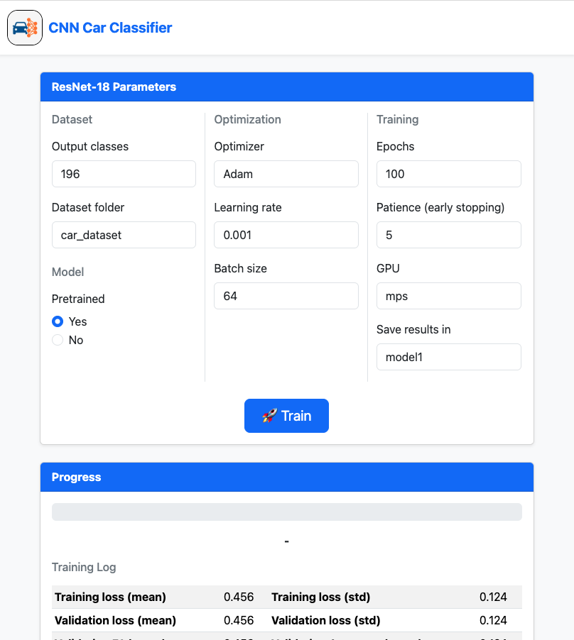
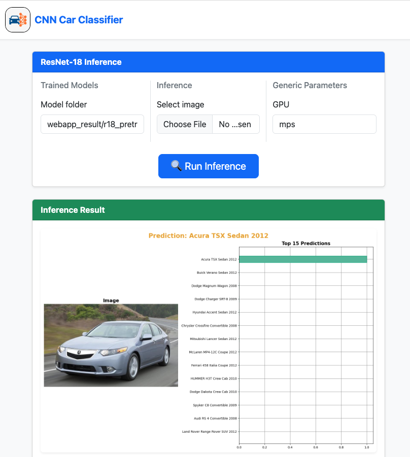

<div style='vertical-align:middle; display:inline;font-size:30px'>
    Car Classifier Web Application
</div>

This project implements a **deep learning pipeline for car image classification** using **ResNet-based Convolutional
Neural Networks (CNNs)**.  
The model is built with **PyTorch** and leverages transfer learning from pretrained ImageNet weights (`resnet18` or
`resnet34`).

The repository also includes a **web application** that allows interactive **training** and **inference** directly from
the browser.

[Report](./static/Cars_Recognizer.pdf)
---

## 🚀 Features

- CNN classifier built on **ResNet18 / ResNet34** architectures.
- Transfer learning with **optional pretrained weights**.
- Configurable number of frozen layers for fine-tuning.
- Training and inference modes accessible via **command-line** or **web interface**.
- Logging of training metrics and model checkpoints.

---

## ⚙️ Installation

### 1. Clone the repository

```bash
git clone https://github.com/jacons/cnn_webapp
conda env create -f environment.yml
conda activate car-classifier
```

## 📂 Dataset

The dataset can be downloaded from Google Drive:
[Car Dataset (Google Drive Link)](https://drive.google.com/file/d/1QwVCrUsseEFTopwKU4lbGOo0ePUsoCN3/view?usp=drive_link)
After downloading, extract it and place it under the datasets/ folder (e.g., datasets/car_dataset/).

## 🌐 Running the Web Application

The application supports both training and inference modes.

Training Mode

```bash
python app.py --train
```

Inference Mode

```bash
python app.py --inference
```

## 🖥️ Running Training from Command Line

You can also train the model directly from the terminal with full configuration options.

Example:

```bash
python car_classifier.py \
    --dataset_path "datasets/car_dataset" \
    --metric_history "results/r18_pretrained_fre0.json" \
    --new_hist \
    --model_cache "results/r18_pretrained_fre0.pth" \
    --batch_size 150 \
    --model_name "resnet18" \
    --pretrained \
    --freeze_layers 0 \
    --num_epochs 15 \
    --device "cuda:2"
```

## 📊 Training & Inference Interface

Below are examples of the training dashboard and inference interface:

🔹 Training Interface



🔹 Inference Interface



## License

[MIT](https://choosealicense.com/licenses/mit/)

## Authors

- [@jacons](https://www.github.com/jacons)

## 📝 Notes

- Code is written entirely by the author.
- Documentation is generated by ChatGPT and later reviewed and validated by the author.